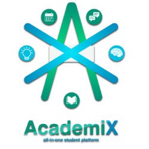
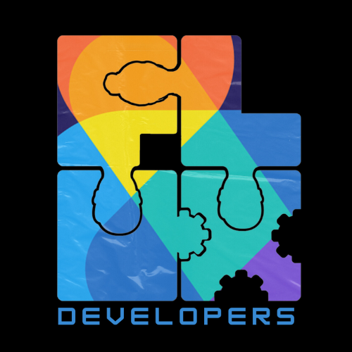

   

<h1 align="center">AcademiX Document Portfolio</h1>

Welcome to the AcademiX Document Portfolio repository!

## Introduction
AcademiX – an all-in-one student platform designed to supercharge learning. AcademiX combines powerful organization tools for managing homework and deadlines with a vibrant social hub for finding study groups and collaborating with classmates. Our platform also features gamified flashcards and quizzes to make studying fun and engaging, and on-demand tutoring to connect students with qualified instructors for personalized online sessions. AcademiX provides everything students need to succeed in one dynamic platform.
  

  

<h3 align="center">FLUX Developers</h3>

We are the Flux Developers, creators of AcademiX! Team Flux emphasizes the concept of three individuals who are interconnected like puzzle pieces, symbolizing unity and teamwork.

<h4 align="center">Members</h4>

Ken Gyrro Acquiat

Zachary Ben Hao

Kathlyn Anne Mejia

